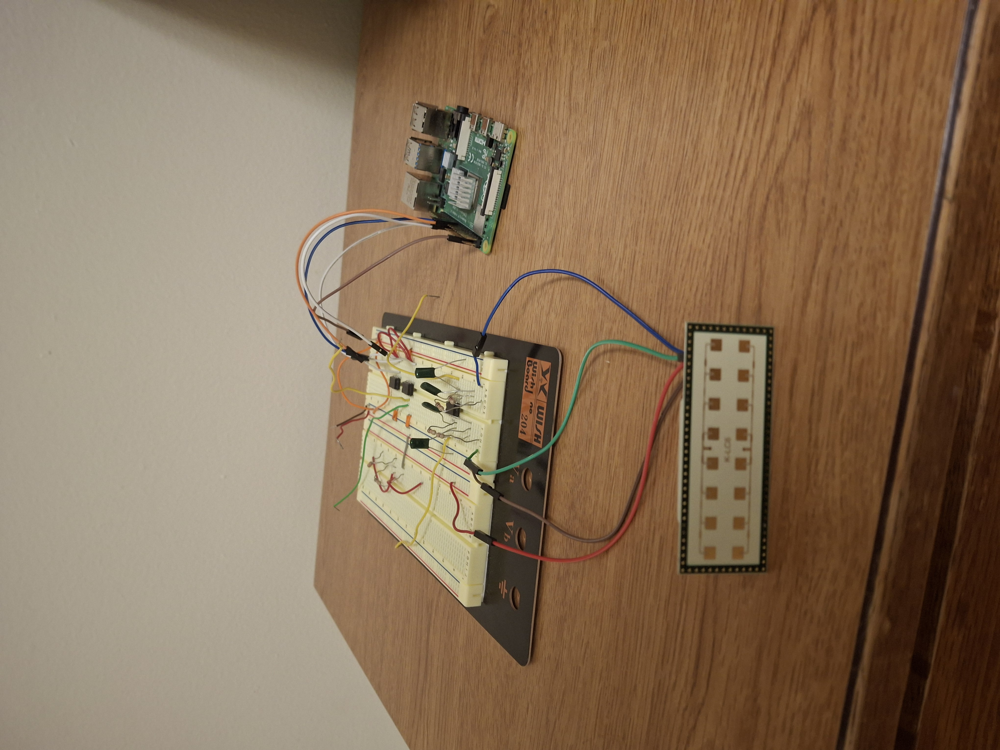
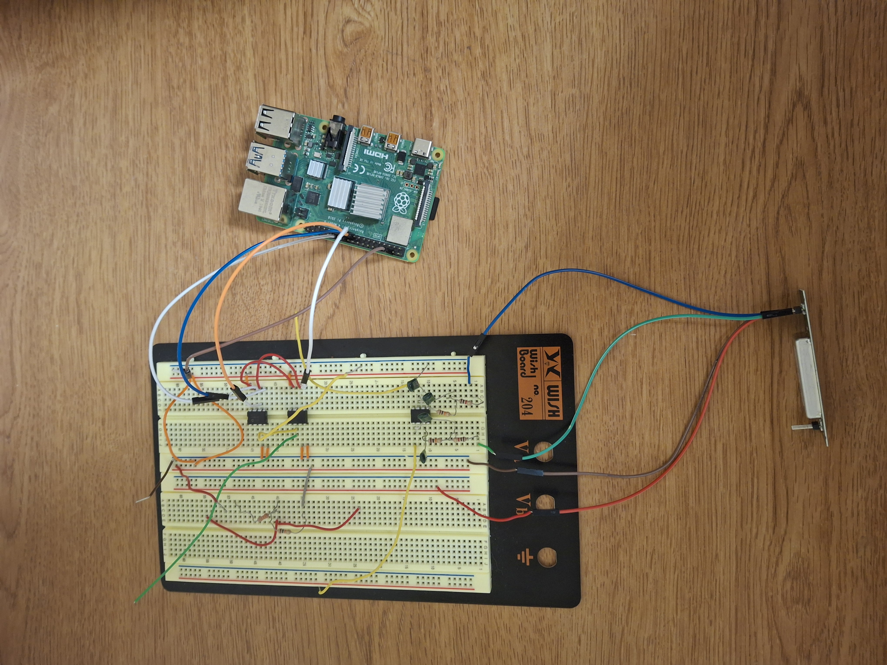

# FMCW Radar Project

This project implements a Frequency Modulated Continuous Wave (FMCW) radar system using the RF K-LC6 radar transceiver and a custom analog front end. The analog section amplifies and filters the I/Q signals from the radar before they are digitized and sent to a Raspberry Pi for processing.

---

## Components Required

- 1 × RF K-LC6 Radar Module  
- 4 × MCP6022 Op Amps  
- 2 × MCP3201 ADCs  
- Various resistors and capacitors (for filtering)  
- 1 × Breadboard  
- 1 × Raspberry Pi Model 4B  
- 1 × 5V power supply  

---

## System Overview

A chirp signal is generated and applied to the radar’s VCO input. The radar outputs two baseband signals: the in-phase (I) and quadrature (Q) components.  
Each signal passes through an op amp for amplification and a 7 kHz low-pass filter to remove unwanted high-frequency components. The filtered signals are then digitized using two MCP3201 ADCs and read by the Raspberry Pi.

### RF K-LC6
- Input: Chirp modulation signal  
- Outputs: I and Q baseband channels  

### MCP3201 ADC Connections (per channel)

| Pin | Connection |
|-----|-------------|
| VD0 | 5 V |
| VREF | 3.3 V |
| IN+ | I or Q signal (from low-pass filter) |
| IN- | GND |
| VSS | GND |
| CLK | GPIO 11 |
| DOUT | GPIO 9 |
| CS (ADC1) | GPIO 8 |
| CS (ADC2) | GPIO 7 |

## Summary of Operation

1. A chirp signal is applied to the radar’s VCO input.  
2. The K-LC6 outputs I and Q baseband signals that represent the mixed transmitted and received chirp.  
3. Each signal is amplified by an MCP6022 stage.  
4. A 7 kHz low-pass filter removes high-frequency noise.  
5. The analog signals are digitized by the MCP3201 ADCs.  
6. The Raspberry Pi reads the samples and performs FFT-based processing to estimate range and velocity.

## System Overview Image 1

## System Overview Image 2

